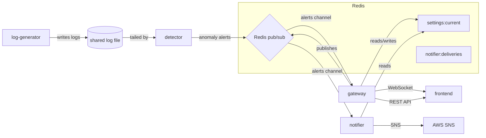

# logix — Real-time log anomaly detector

## Architecture



Five services communicating over Redis pub/sub:
- **log-generator** — writes synthetic log lines to a shared file (`/data/app.log`)
- **detector** — tails the log file, computes per-window error rates, and publishes alerts on Redis channel `alerts`
- **gateway** — relays alerts to browser WebSocket clients, exposes REST API for settings, stats, health
- **notifier** — forwards alerts to AWS SNS with dedup, digest mode, and retry hardening
- **frontend** — React SPA with summary cards, chart, alert detail drawer, controls, CSV export, settings UI

## Settings

User-customizable via the Settings tab in the frontend or the gateway REST API (`GET/PUT /settings`, `POST /settings/reset`).

| Setting | Type | Default | Range |
|---|---|---|---|
| `window_seconds` | integer | 60 | 10–300 |
| `warmup_seconds` | integer | 120 | 0–600 |
| `min_events` | integer | 20 | 5–500 |
| `ewma_alpha` | float | 0.05 | 0.01–0.5 |
| `severity_thresholds.low` | float | 3 | — |
| `severity_thresholds.medium` | float | 4 | — |
| `severity_thresholds.high` | float | 6 | — |
| `severity_thresholds.critical` | float | 9 | — |
| `cooldown_seconds` | integer | 30 | 0–300 |
| `notify_min_severity` | string | MEDIUM | LOW/MEDIUM/HIGH/CRITICAL |
| `notifications_enabled` | boolean | true | — |

Thresholds must be strictly increasing. Changing thresholds takes effect immediately without restart.

## Quick start

```bash
cp .env.example .env
docker compose up --build -d
```

The stack starts: Redis, log-generator, detector, gateway (port 8001), notifier, and frontend (port 8080).

## How to demo each feature (under 60s)

1. **Alerts appear in the frontend** — open http://localhost:8080 after ~2 minutes (warmup period)
2. **Change thresholds** — Settings tab, lower `severity_thresholds.low` to 1, Save. Next spike will alert at LOW sooner
3. **Test notification** — `curl -X POST http://localhost:8001/notifications/test`
4. **Check notification log** — `curl http://localhost:8001/notifications`
5. **Export CSV** — click "Export CSV" button in the Alerts tab
6. **Acknowledge** — click "Acknowledge" on any alert row; use "Unacknowledged only" toggle

## API endpoints

| Method | Path | Description |
|---|---|---|
| GET | `/health` | Health check (redis status, ws clients) |
| GET | `/settings` | Current settings |
| PUT | `/settings` | Update settings (validated) |
| POST | `/settings/reset` | Restore default settings |
| GET | `/stats` | Alert counts by severity |
| GET | `/logs` | Recent log file lines |
| GET | `/notifications` | Recent notifier delivery log |
| POST | `/notifications/test` | Publish a synthetic test alert |
| WS | `/ws` | WebSocket alert stream |

## Running tests

```bash
# Each service has its own virtualenv
cd services/gateway && .venv/bin/pip install -r requirements.txt && .venv/bin/pytest
cd services/detector && .venv/bin/pip install -r requirements.txt && .venv/bin/pytest
cd services/notifier && .venv/bin/pip install -r requirements.txt && .venv/bin/pytest
cd services/frontend && npm ci && npm test
```

## Environment variables

See `.env.example` for the full list. All services read config from env vars.

## Contracts

Alert messages on the `alerts` Redis channel must validate against `contracts/alert.schema.json`. Settings are stored in Redis key `settings:current` and validated against `contracts/settings.schema.json`. See `AGENTS.md` for the full contract.